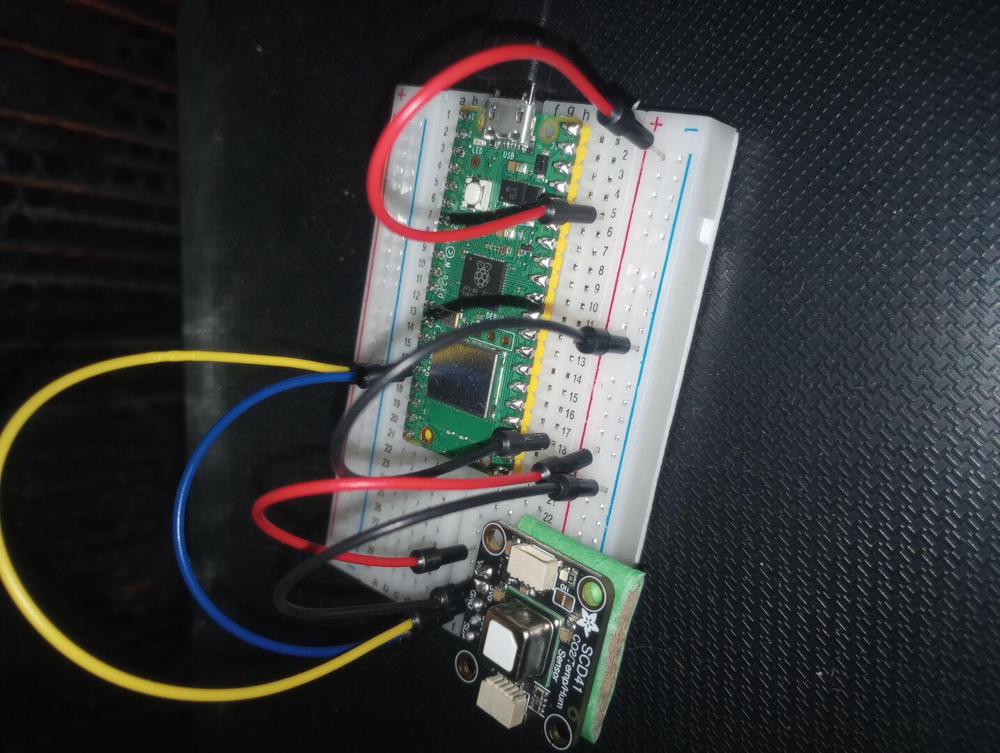
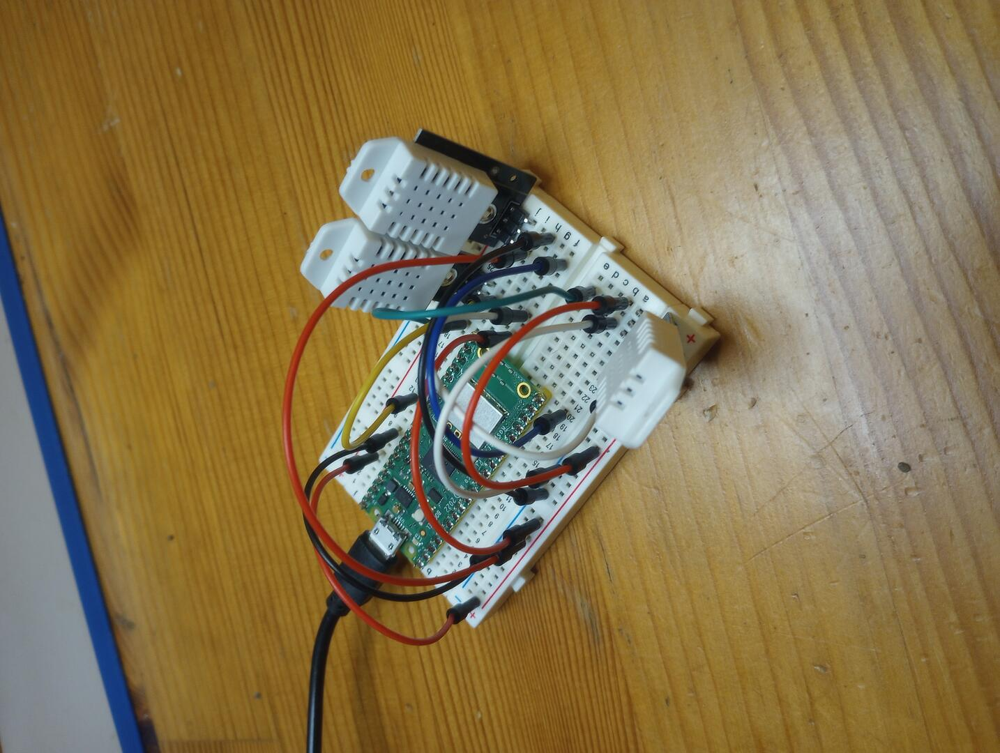
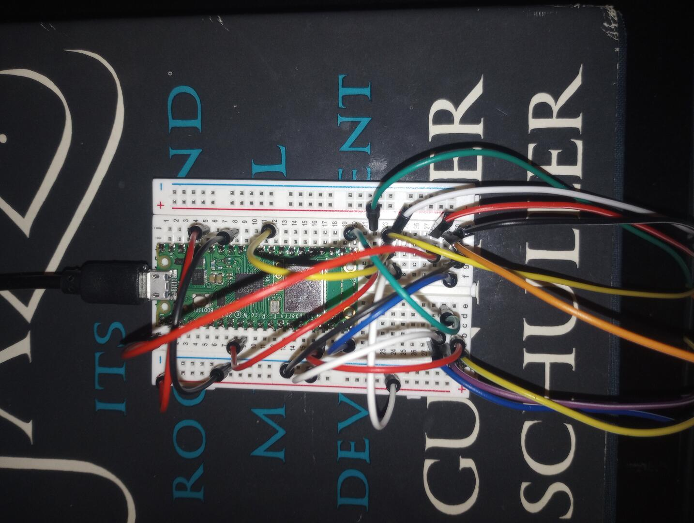

Raspberry Pi Pico W
===================
I've been playing with the [Raspberry Pi Pico W][1] to create WiFi connected
sensors like the [SCD41][2] (CO₂) and the [DHT22][3] (temperature and
humidity).

Each subdirectory in this repository is either a "project" or a
submodule/copy-paste of existing open source code.

My workflow is to modify one of the projects, say, [dht22/][4]. Then to build
the code I run `bin/build dht22`. It defaults to debug mode; for release mode
run `bin/build dht22 release`. Then I plug in the Pico via USB in boot select
mode and run `bin/install-and-monitor dht22`. That copies the built uf2 file
onto the Pico, which then reboots, and when the USB terminal interface becomes
available we attach to it using GNU Screen.

A lot of what I've done so far is organized into a separate library of
Pico-specific C++20 coroutines, [picoro][5].

Gallery
-------

[1]: https://datasheets.raspberrypi.com/picow/pico-w-datasheet.pdf
[2]: https://sensirion.com/media/documents/48C4B7FB/64C134E7/Sensirion_SCD4x_Datasheet.pdf
[3]: https://cdn-shop.adafruit.com/datasheets/Digital+humidity+and+temperature+sensor+AM2302.pdf
[4]: ./dht22
[5]: https://github.com/dgoffredo/picoro
