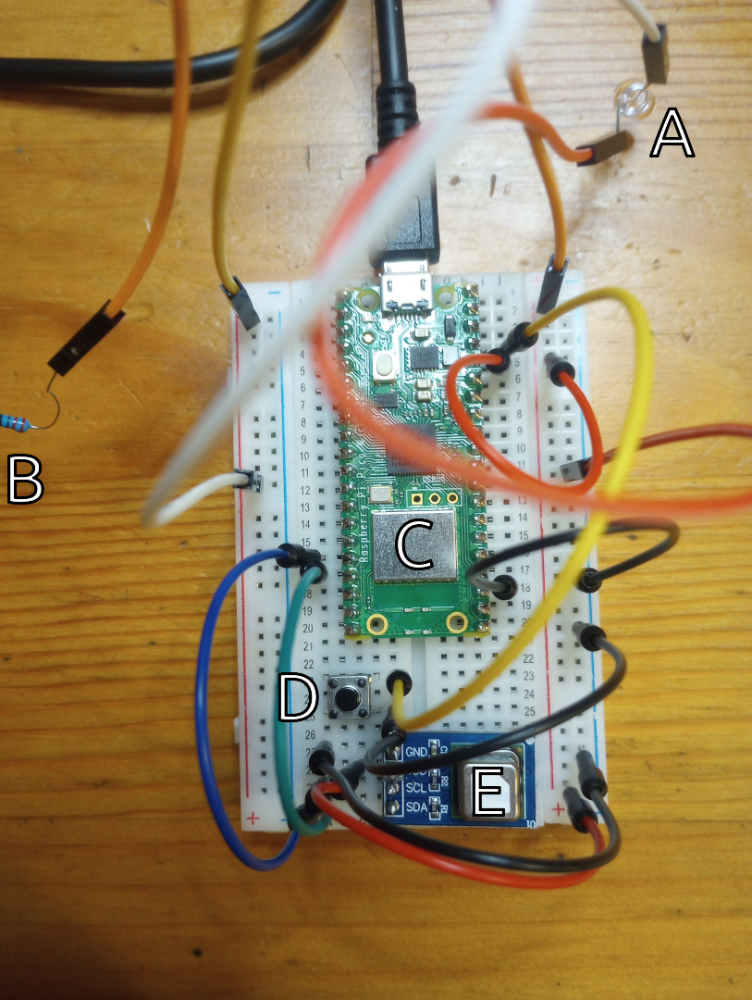

Damned Thing Won't Work
=======================
I'm trying to measure CO₂ from a [SCD41][1] sensor by having a
[Raspberry Pi Pico W][2] ([pinout][3]) talk to it over I²C.

The sensor is visible on the bus, and I can query it for information about its
configuration. However, whenever I tell the sensor to take a measurement or to
perform a self test, I'm afterward not able to query the result. Micropython's
I²C wrapper raises an exception `EIO`.

Hardware
--------


- The LED `A` and resistor `B` connect the pico's 3.3 V power to ground,
  allowing me to see when the device has power.
- `C` is the pico (the label is on the WiFi chip, but the entire green board is
  the pico).
- `D` is a push button that, when pressed, shorts the pico's 3.3 V enable pin
  to ground. I use this to power cycle the pico's CPU and everything connected
  to the pico's 3.3 V power, including the SCD41 sensor.
- `E` is the SCD41 CO₂ sensor. It's connected to the pico's 3.3 V power and
  ground, and communicates with the pico over the pico's I2C0 bus.

The board is powered through that USB Mini-B cable, which is connected to my
laptop.

Software
--------
I'm using the pico's flavor of [micropython][4] and the [Thonny][5] IDE.

I've played with two micropython drivers for the SCD41:
[peter-l5/MicroPython_SCD4X][6] and [octaprog7/SCD4x][7].

The code here is based on octaprog7/SCD4x. The git submodule `SCD4x` is my
debug fork of octaprog7's code.

My development process goes like this:

1. Open up Thonny.
2. Connect the pico to my laptop over USB.
3. The pico's onboard LED will blink for two seconds on account of the
  [main.py](main.py) program installed on the pico.
4. Click the "Stop/Restart Backend" button in Thonny to connect it to the pico.
5. Hack on [i2c-noodle-russian.py](i2c-noodle-russian.py) in an editor.
6. Click the "Run current script" button in Thonny to execute
   `ic2-noodle-russian.py` on the pico.
7. Wail at my repeated failure.
8. Press the black push button on the breadboard to power cycle everything.
9. GOTO 3.

`ic2-noodle-russian.py` is based on `SCD4x/main.py`, but I've since modified it
a lot.

It creates an `machine.I2C` object, enumerates the devices connected to the
bus, then wraps it in octaprog7's `I2cAdapter`, and uses the adapter to create
a `scd4x_sensirion.SCD4xSensirion` object.

There are `if True:` and `if False:` code blocks that allow me to control which
failure I want to see. Then `sys.exit()` is called — the code afterward is
more of octaprog's original `main.py`.

Whenever I modify a source file that isn't `ic2-noodle-russian.py`, I have to
remember to copy it onto the pico. Right now the pico contains:

- `sensor_pack/`, copied from `SCD4x/sensor_pack`
- `lib/picozero/`, which I installed using Thonny's
  "Tools > Manage packages..." menu option.
- `main.py`, copied from [main.py](main.py)
- `scd4x_sensirion.py`, copied from `SCD4x/scd4x_sensirion.py`

Here's what a micropython session running `ic2-noodle-russian.py` looks like,
as of this writing:
```pycon
MicroPython v1.23.0 on 2024-06-02; Raspberry Pi Pico W with RP2040
Type "help()" for more information.
>>> %Run -c $EDITOR_CONTENT
Scanning i2c bus...
Devices: ['0x62']
Going to write 0x36 0x82 to device address 0x62
Going to read 9 bytes from device address 0x62
Sensor id 3 x Word: 66c0:5b07:3b22
Going to write 0x23 0x18 to device address 0x62
Going to read 3 bytes from device address 0x62
Get temperature offset from sensor: 4.000091 Celsius
Going to write 0x23 0x22 to device address 0x62
Going to read 3 bytes from device address 0x62
Get M.A.S.L. from sensor: 0 meter
Going to write 0xe4 0xb8 to device address 0x62
Going to read 3 bytes from device address 0x62
Measurement data is not ready
Going to write 0x23 0x13 to device address 0x62
Going to read 3 bytes from device address 0x62
The automatic self-calibration is ON
Setting sensor to periodic measurement mode.
Going to write 0x21 0xb1 to device address 0x62
sleeping for 5 seconds
Checking if measurement data is ready.
Going to write 0xe4 0xb8 to device address 0x62
Traceback (most recent call last):
  File "<stdin>", line 108, in <module>
  File "<stdin>", line 96, in check
  File "scd4x_sensirion.py", line 294, in is_data_ready
  File "scd4x_sensirion.py", line 84, in _send_command
  File "scd4x_sensirion.py", line 59, in _write
  File "sensor_pack/bus_service.py", line 112, in write
OSError: [Errno 5] EIO
>>>
```
I've tried the following things:

- Sleep for longer than 5 seconds. It makes no difference.
- Instead of checking if measurement data is ready, just read it instead. Same
  error (`EIO`).
- Do a single-shot measurement instead of putting the sensor in periodic
  measurement mode. Same error (`EIO`).
- Do a device self-test. This fails when we try to read the result; the error
  is `EIO`.

An online message board thread that I found makes me wonder if the `EIO` is due
to the sensor issuing NACKs whenever it's in a mode where it's supposed to be
doing something. I have yet to dig deeper into I2C to find out if this is the
case.

[1]: https://sensirion.com/media/documents/48C4B7FB/64C134E7/Sensirion_SCD4x_Datasheet.pdf
[2]: https://datasheets.raspberrypi.com/picow/pico-w-datasheet.pdf
[3]: https://datasheets.raspberrypi.com/picow/PicoW-A4-Pinout.pdf
[4]: https://docs.micropython.org/en/latest/
[5]: https://thonny.org/
[6]: https://github.com/peter-l5/MicroPython_SCD4X
[7]: https://github.com/octaprog7/SCD4x
